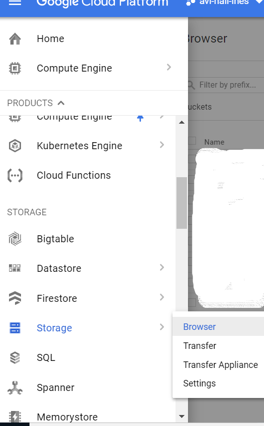
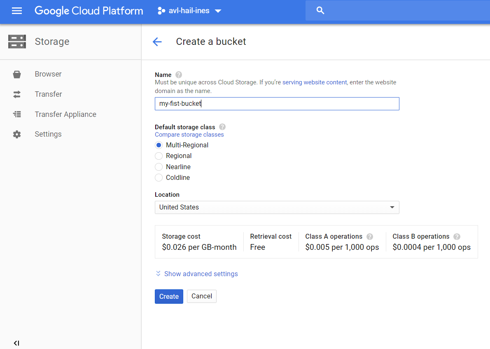
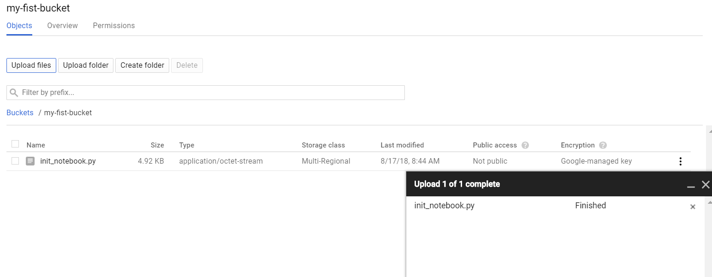
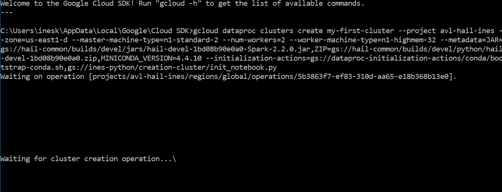
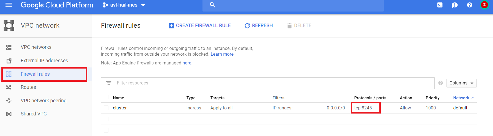

# Hail-on-Google-Cloud

## Deploy a Hail 0.2 cluster (https://hail.is/) in Google Cloud.

Learn how to create a dataproc cluster with Hail 0.2 on Google Cloud.

For MAC OS, you can use **cloudtools**, see https://github.com/Nealelab/cloudtools .

### Prerequisites

1. Have a Google Cloud Account

**A google cloud account is required** with enough credentials. When your account is created, you will need to **create a project** in which the clusters will be launched and the data will be saved (https://cloud.google.com/resource-manager/docs/creating-managing-projects).

2. Install Google Cloud SDK

Google Cloud SDK is a set of tools that you can use to manage resources and applications hosted on Google Cloud Platform. It will be easier to launch and detete cluster though SDK. **Install the SDK cloud** for your specific OS. Follow all the steps described in https://cloud.google.com/sdk/docs/. You will need **to provide the name of your project**. For Mac or Linux User, it will be fully integrated in your terminal. For Windows user, you will have to use a new command prompt terminal. 

3. Download the initialization script

To be able to launch a hail cluster, download and **upload in one of your bucket in google storage the init_notebook.py** available in this repository. It will be one of the initialization-actions. This script installs appropriately Hail, Python 3.6 with the most used packages (matplotly, pandas, searborn ...) and Jupyter notebook.




You will need fist to create a bucket and after to upload the init_notebook.py script.






### Some guidelines for the cluster configurations

#### Cluster Size

Our advice in terms of cluster size (which are the default settings given in the example that follows) are : 

- Choose a small machine for the master node that is not the machine that performs the tasks, for example *n1-standard-2*

- A number of worker nodes between 2 and 4 should be enough to start.

- For the worker nodes, the machine will be identical and it must be chosen according to your needs. You can choose the machine instance type in
https://cloud.google.com/compute/docs/machine-types To begin, you can use *n1-highmem-32* ($1.8944 per hour).
Always try to keep an eye on the price of your machines with https://cloud.google.com/compute/pricing or https://cloud.google.com/products/calculator/

- You can use preemptile worker nodes to create very large clusters at a lower total cost.
https://cloud.google.com/dataproc/docs/concepts/compute/preemptible-vms

#### Hail version

Hail is now released but Hail team commits regularly to solve some issues.
If you want to create a cluster with the latest version of Hail 0.2, you have to retrieve the number from https://github.com/hail-is/hail. 


All the JAR and ZIP files are available via the command  ```gsutil ls -r gs://hail-common/builds/0.2/jars ``` and ```gsutil ls -r gs://hail-common/builds/0.2/python ``` Replace #version_number with the version that you want. 

Here  ```d33e2d1c19b2``` for example.


### An example step by step !

Use your terminal (or the SDK terminal for windows user) to type all the following commands. 

1. Launch a Hail cluster 
```
gcloud dataproc clusters create *cluster-name* \
--project *your-project* \
--zone=us-east1-d \
--master-machine-type n1-standard-2 \
--num-workers 2 \
--worker-machine-type n1-standard-16 \
--num-preemptible-workers=2 
--image-version=1.2-deb9 \
--metadata=JAR=gs://hail-common/builds/0.2/jars/hail-0.2-d33e2d1c19b2-Spark-2.2.0.jar,ZIP=gs://hail-common/builds/0.2/python/hail-0.2-d33e2d1c19b2.zip,MINICONDA_VERSION=4.4.10 \
--initialization-actions=gs://dataproc-initialization-actions/conda/bootstrap-conda.sh,gs://my-first-bucket/init_notebook.py
```


The cluster installation is complete in less than 10 minutes.



2. Connect to your cluster and open Jupyter Notebook

The url to have access to the Jupyter Notebook will be : http://ExternalIP:port.

You can find the external IP in the google API. The port is 8123 by default. You have to open a firewall rule to allow traffic to and from your virtual machines (go to VPC Network -> Firewall rules -> Create firewall rule). 



To connect and open Jupyter Notebook for this specific example, you will use the URL http://35.229.17.83:8245. 
And the password is *hello-hail* by default. 


3. Submit a hail job with a python script 
```
gcloud dataproc jobs submit pyspark gs://path-to/python-script.py --cluster=*cluster-name* --project=*your-project*
```

4. Delete the cluster 

Don't forget to delete your cluster if you don't need it anymore !
```
gcloud dataproc clusters delete *cluster-name*
```


